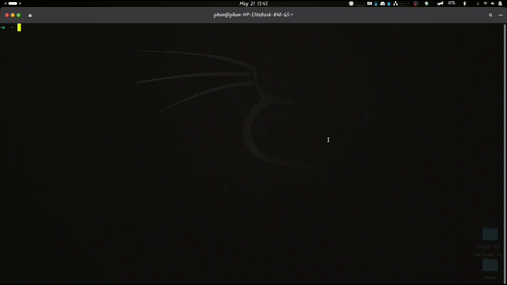

# cmdstr

[](LICENSE)

**cmdstr** is a smart command storage and recall tool for the terminal. It automatically captures every command you run, stores it in a local SQLite database, and lets you search, tag, annotate, bookmark, and re-run commands with ease. It also ships with a premium hacker-themed interactive TUI for browsing and managing your command history.

Never lose that complicated `ffmpeg` incantation or that perfect `docker` command again.



---

## Features

- **Auto-capture** — every command, exit code, duration, working directory, and hostname.
- **Robust Self-Filtering Shell Hooks** — Includes self-filtering logic for Bash, Zsh, and Fish that ignores `cmdstr` commands and whitespace inputs to prevent loop capturing.
- **Flexible Tagging UX** — Search and tag commands using a 26-character ID, a short-ID prefix, or any substring matching the command text.
- **Input Validation** — Prevents command history clutter by rejecting empty and whitespace-only command records.
- **Full-text search** — fuzzy search commands, tags, and notes.
- **Annotations** — add explanatory notes or bookmark favourites.
- **Statistics & Analytics** — View unique execution counts, success ratios, bookmark distributions, and timeframes.
- **Export** — Export history cleanly to pretty JSON or standard CSV.
- **Direct execution** — tag a command and run it later with `cmdstr run <tag>` or just `cmdstr <tag>`.
- **Interactive TUI Overhaul** — Premium hacker-themed terminal UI dashboard with active panel border highlighting, focus cycling, first-run welcome screen overlays, inline hints, clipboard copy support, and a comprehensive on-screen manual popup.
- **TUI Help & Manual Popup** — Press `?` or `F1` in the TUI to access a dynamically-sized, clean, categorized manual with Navigation, Actions, Organization, and Tools guides.

---

## Installation

### From PPA (Ubuntu / Debian)

```bash
sudo add-apt-repository ppa:gihan0205/ppa
sudo apt update
sudo apt install cmdstr
```

**Troubleshooting:**
If you get a `NO_PUBKEY` error during `apt update` (usually caused by strict firewalls blocking the keyserver), you can manually add the key:
```bash
sudo apt-key adv --keyserver keyserver.ubuntu.com --recv-keys 58CBF0A2D6469234
sudo apt update
sudo apt install cmdstr
```

### From source

```bash
git clone https://github.com/ceeejeey/cmdstr.git
cd cmdstr

# Build and test
cargo build --release
cargo test

# Verify the version
cargo run --release -- --version

# Install system-wide
sudo cp target/release/cmdstr /usr/local/bin/
```

### Install shell hooks (recommended)

```bash
cmdstr install
```

This auto-detects your active shell (Bash, Zsh, or Fish) and installs highly optimized hook scripts in `~/.bashrc`, `~/.zshrc`, or `~/.config/fish/config.fish` with loop-prevention filters. Restart your shell or source the profile to activate.

---

## Quick Start

```bash
# Show comprehensive global help and master workflow examples
cmdstr --help

# Show help for a specific command
cmdstr tag --help
cmdstr search --help

# Search your command history
cmdstr search docker

# Tag a command (by ID, short ID, or any command substring)
cmdstr tag "docker run -d nginx" webserver,nginx

# Run a tagged command (prompts for confirmation before running)
cmdstr run webserver
# Or shorthand:
cmdstr webserver

# Launch the premium interactive TUI
cmdstr tui

# View analytics and usage stats
cmdstr stats
```

---

## Commands & CLI Documentation

Every command in the `cmdstr` tool is fully documented with a descriptive `long_about` and practical command examples.

### `capture` — Capture a command
Called automatically by shell hooks. Records a command, its exit code, duration, working directory, hostname, and session ID. Empty or whitespace commands are automatically filtered out.
```bash
cmdstr capture "docker ps -a" 0 234 /home/user abc123-session
```

### `add` — Manually record a command snippet
Saves a command snippet directly into history without running it. Useful for preserving command templates or scripts.
```bash
cmdstr add "sudo systemctl restart nginx" --tag nginx,systemd --note "Restart after config change"
cmdstr add "curl -s https://api.example.com" --tag api,testing
```

| Flag | Description |
|------|-------------|
| `-t, --tag` | Comma-separated tags |
| `-n, --note` | Explanation note or description |
| `--exit-code` | Exit code (default: 0) |
| `--duration` | Run duration in ms (default: 0) |

### `search` / `list` — Search and filter history
Fuzzy matches commands, tags, and annotations. Outputs formatted tables or pretty JSON array structures.
```bash
# Search for keyword anywhere in command strings
cmdstr search docker

# Filter commands by specific tag name
cmdstr search --tag nginx

# Show failed commands from the last 24 hours
cmdstr search --failed --last 24

# List bookmarked commands only
cmdstr search --bookmarks

# List command frequencies (execution counts)
cmdstr search --freq
```

| Flag | Description |
|------|-------------|
| `query` | Fuzzy match keyword query |
| `-t, --tag` | Filter by specific tag name |
| `--last` | Only show commands from last N hours |
| `--failed` | Only show failed commands (exit_code != 0) |
| `--freq` | Show command frequency stats |
| `--bookmarks` | Show bookmarked commands only |
| `-l, --limit` | Limit results (default: 30) |
| `--json` | Format output as pretty JSON |

### `tag` — Tag a stored command
Binds tag names to a command. Locate commands via:
1. Exact 26-character ULID (ID)
2. Short ID prefix (e.g. first 8 characters of ID)
3. Raw command text string (exact or substring matched; resolves to the most recent run if multiple exist)
```bash
# Tag by exact ID
cmdstr tag 01H6W4A5G6C8D9E8F7A6B5C4D3 docker,dev

# Tag by short ID prefix
cmdstr tag 01H6W4A5 quickstart

# Tag by command text substring
cmdstr tag "ffmpeg -i input.mp4" video,ffmpeg
```

### `annotate` / `note` — Annotate and Bookmark
Add explanatory descriptions or bookmark specific commands to highlight them.
```bash
cmdstr annotate 01H6W4A5 "Starts Next.js dev server"
cmdstr note 01H6W4A5 "Key deployment script" --bookmark
```

| Flag | Description |
|------|-------------|
| `--bookmark` | Mark target command as bookmark |

### `stats` — Analytics & History aggregates
```bash
cmdstr stats
cmdstr stats --json
```

### `install` — Configure shell capture hooks
```bash
cmdstr install
cmdstr install --shell zsh
cmdstr install --bin-path /usr/local/bin/cmdstr
```

### `export` — Export database records
Redirections output to standard output or a specified target file.
```bash
cmdstr export --format json
cmdstr export --format csv --output ~/history_backup.csv
```

### `run` — Execute a tagged command
Locates the command matching the tag and safely prompts you before executing it.
```bash
cmdstr run webserver
# Or shorthand:
cmdstr webserver
```

---

## Interactive TUI (`cmdstr tui`)

Launch our premium hacker-themed dashboard to explore history dynamically:
```bash
cmdstr tui
```

### Premium UI Overhaul Additions
* **Active Panel Highlighting**: Active borders glow in vibrant green (or red in elevated mode), while inactive panel borders are dimmed to direct your attention.
* **Focus Cycling**: Use `Tab` to cycle active focus between the Command List and Details/Output panels. Navigation keys (`j`/`k`, `g`/`G`) automatically switch functions depending on the active focus.
* **Clipboard copy**: Press `c` on any selected command in the list to instantly copy it to your system clipboard.
* **Welcome Screen Overlay**: First-run experience that overlays beautiful startup instructions when your database is empty.
* **Inline Input Placeholders**: Interactive input modes display italicized gray placeholder hints (e.g. search guides, comma-separated tags, note details, or password indicators) that fade out as you type.
* **TUI Help & Manual Popup**: Press `?` or `F1` to reveal a dynamically-sized manual detailing advanced keybindings, navigation, database actions, and quick utility tools.

### TUI Keybindings & Controls

#### Navigation & Selection
| Key | Focused Panel: Command List | Focused Panel: Details/Output |
|-----|-----------------------------|-------------------------------|
| `Tab` | Switch focus to Details Panel | Switch focus to Command List |
| `↑` / `↓` or `j` / `k` | Navigate command list | Scroll output log up/down |
| `Ctrl+↑` / `Ctrl+↓` | Scroll output log up/down | Scroll output log up/down |
| `PageUp` / `PageDown` | Scroll output by 5 lines | Scroll output by 5 lines |
| `g` / `G` | Jump to Top / Bottom of list | Scroll to Top / Bottom of log |
| `?` / `F1` | Open TUI Manual Popup | Open TUI Manual Popup |

#### Command Executions
| Key | Action |
|-----|--------|
| `Enter` | Run selected command |
| `r` | Run an arbitrary user command |
| `S` | Toggle **Sudo Mode** (switches TUI to red-on-black, prefixes run commands with `sudo`) |

#### Database Actions
| Key | Action |
|-----|--------|
| `/` or `s` | Search / filter history (filters on text, tags, and notes) |
| `t` | Add / edit tags for selected command |
| `n` or `a` | Add / edit note for selected command |
| `b` | Toggle bookmark flag (`★`) |
| `d` | Delete selected command |
| `w` | Manually record command to store (capture without executing) |
| `i` | View history analytics and usage statistics in output pane |
| `e` | Export entire command history to `~/cmdstr_export.json` |

#### Exit Controls
| Key | Action |
|-----|--------|
| `Esc` | Clear active search filter, cancel current input, or dismiss popup |
| `q` | Quit TUI dashboard safely |
| `Ctrl+C` | Instant quit from any active mode |

---

## Shell Integration Hooks

### How it works
Startup hooks configure pre-execution traps or event registers based on shell environments. As commands complete, hooks query:
- Target command text string
- Start and end execution timestamps (nanosecond precision)
- Process exit code status
- Current working directory
- Per-session unique terminal ID

Data is captured asynchronously (`2>/dev/null || true`) ensuring that `cmdstr` never blocks your shell or slows down operations.

### Recursive capturing prevention
All hooks incorporate self-filtering loops:
* Bash: native trap matching ignores all inputs starting with `cmdstr` or whitespace elements.
* Zsh: uses native `add-zsh-hook preexec` with immediate checks to bypass capturing recursive loops.
* Fish: standard post-execution ignores inputs containing `cmdstr` structures.

---

## Data Storage

cmdstr follows the [XDG Base Directory Specification](https://specifications.freedesktop.org/basedir-spec/latest/):

| Path | Purpose |
|------|---------|
| `$XDG_DATA_HOME/cmdstr/commands.db` | SQLite database |
| `$XDG_CONFIG_HOME/cmdstr/config.toml` | Configuration settings |

Defaults:
- `$XDG_DATA_HOME` -> `~/.local/share/`
- `$XDG_CONFIG_HOME` -> `~/.config/`

---

## Building & Development

```bash
# Debug build
cargo build

# Release build
cargo build --release

# Run comprehensive test suite (70+ unit/integration tests)
cargo test

# Check code formatting & warnings
cargo clippy
```

---

## License

MIT — see [LICENSE](LICENSE).
